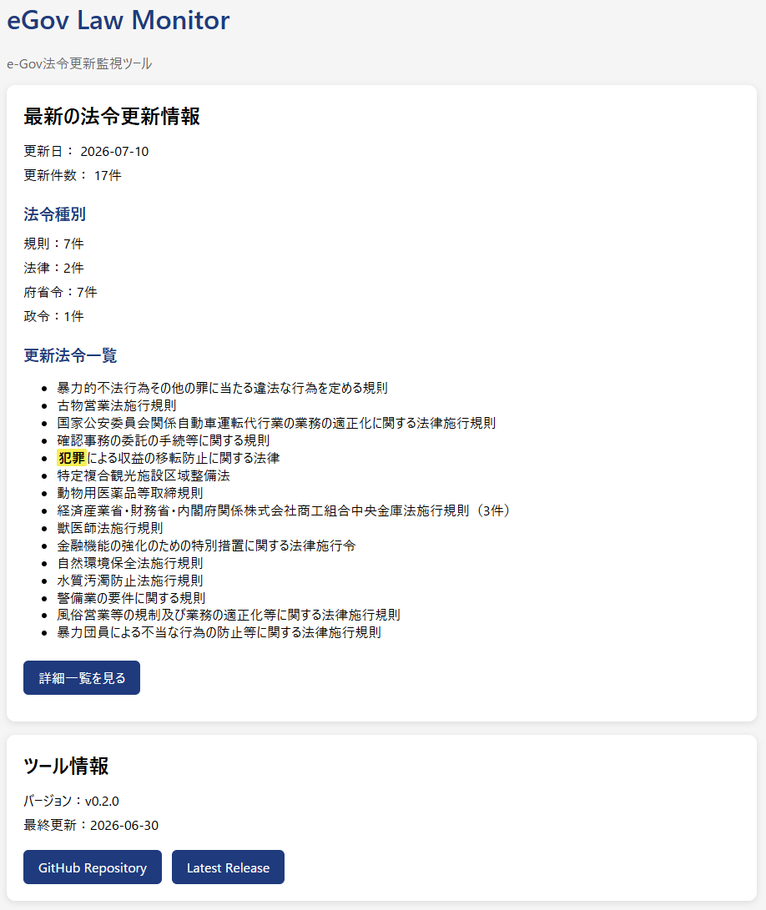

# eGov Law Monitor

e-Gov法令検索で公開される法令更新情報を毎日自動取得し、GitHub Pagesで公開するツールです。

GitHub Actionsにより毎日自動実行され、更新された法令情報をダッシュボードとメールで確認できます。

日々の法令改正を効率よく把握することを目的として開発しています。

---

## 主な機能

- e-Gov法令更新情報の自動取得
- GitHub Actionsによる毎日の自動実行
- 更新法令一覧の生成
- 法令名ごとの更新グループ表示
- 更新件数・更新日の表示
- 法令種別ごとの件数集計
- キーワードハイライト表示
- e-Gov本文へのリンク
- GitHub Pagesへの自動公開
- 更新日のみメール通知
- GitHub ActionsからのSMTPメール送信

---

## 公開ページ

GitHub Pages

https://fumizoh.github.io/egov-law-monitor/

---

## 画面イメージ

トップページでは更新件数や法令種別ごとの集計を確認できます。
詳細ページでは更新された法令一覧とe-Govへのリンクを表示します。

### ダッシュボード



### 更新法令一覧


---

## ディレクトリ構成

```text
.
├── .github/
│   └── workflows/
│       └── check.yml
│
├── docs/
│   ├── css/
│   ├── data/
│   │   ├── app.json
│   │   ├── keywords.json
│   │   ├── statistics.json
│   │   └── updates.json
│   ├── js/
│   ├── index.html
│   └── updates.html
│
├── src/
│   ├── config.py
│   ├── email_generator.py
│   ├── egov_bulk.py
│   ├── mailer.py
│   ├── monitor.py
│   ├── storage.py
│   ├── summary.py
│   └── update_parser.py
│
├── CHANGELOG.md
├── LICENSE
├── README.md
└── VERSION
```

---

## 動作イメージ

```text
e-Gov
   │
   ▼
GitHub Actions（毎日実行）
   │
   ▼
Python
   │
   ├── updates.json
   ├── statistics.json
   └── メール通知
   │
   ▼
GitHub Pages
   │
   ▼
法令更新ダッシュボード
```

---

## データ構成

### updates.json

更新された法令一覧を保存します。

GitHub Pagesでは更新法令一覧画面の表示に使用します。

### statistics.json

更新日・更新件数・法令種別ごとの件数を保存します。

### keywords.json

ウォッチ対象となるキーワードを管理します。

GitHub Pagesではハイライト表示、メール通知では強調表示に使用します。

### app.json

アプリケーション情報を保存します。

---

## 自動実行

GitHub Actionsにより毎日自動実行されます。

処理内容

1. e-Gov更新情報取得
2. ZIPダウンロード
3. CSV展開
4. JSON生成
5. GitHub Pages更新
6. 更新日のみメール通知

---

## メール通知

更新があった日のみ、法令更新メールを送信します。

メールには

- 更新日
- 更新件数
- 更新法令一覧
- キーワード強調表示
- GitHub Pagesへのリンク

を掲載し、更新履歴として保存できます。

---

## 使用技術

- Python 3.13
- GitHub Actions
- GitHub Pages
- HTML
- CSS
- JavaScript
- SMTP（メール通知）

---

## 今後の予定

- キーワード管理画面
- 法令名検索
- 法令種別フィルター
- HTMLメール対応
- スマートフォン表示の改善

---

## ライセンス

MIT License